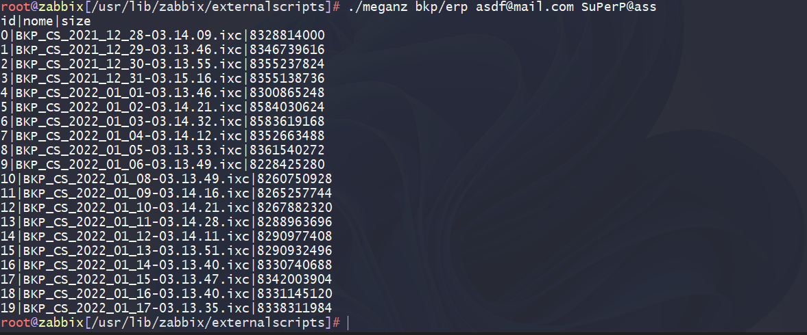

# Zabbix + Mega.nz

## Monitorar pastas e arquivos com zabbix no MEGA.NZ

> Monitorar pastas e arquivos com zabbix no [MEGA.NZ](https://mega.nz/)

## [MEGATOOLS](https://manpages.debian.org/testing/megatools/index.html)

### Cliente de linha de comando para o serviço de armazenamento em nuvem Mega

> Megatools é uma coleção de programas para acessar o serviço [MEGA.NZ](https://mega.nz/) a partir da linha de comando.
>
> Megatools permitem que você copie arquivos individuais, bem como árvores de diretórios inteiras de e para a nuvem. Você também pode realizar downloads de streaming, por exemplo, para visualizar vídeos e arquivos de áudio, sem precisar baixar o arquivo inteiro primeiro.
>
> Megatools são robustos e otimizados para operação rápida - tão rápido quanto os servidores Mega permitem. Os requisitos de memória e a utilização da CPU são mantidos no mínimo.

### INSTALAÇÃO

```sh
apt install megatools
```

## SCRIPT

### PARA BAIXAR

```sh
cd /usr/lib/zabbix/externalscripts
wget https://raw.githubusercontent.com/saulotarsobc/zabbix-files-megaNZ/main/mega.sh
```

> Copie o script abaixo.

```sh
#! /bin/bash
alert(){
    echo -e "Tente: ./meganz DIRETORIO_NO_MEGA EMAIL_DO_MEGA SENHA_DO_MEGA";
    exit 0;
}
if [ "$1" = "" ]; then alert; fi;

dir=$1; u=$2; p=$3;

size=($(megals -u $u -p $p /Root/$dir -l |grep -E '\.ixc' |sed 's/.*\s\s\s//' |sed 's/\s.*//'));
nome=($(megals -u $u -p $p  /Root/$dir -l |grep -E '\.ixc' |sed 's/.*\///'));

ID=0;
echo "id|nome|size";
for i in "${size[@]}"; do
    echo "$ID|${nome[$ID]}|${size[$ID]}";
    let ID=ID+1;
done;
```

```sh
chmod +x meganz
```

### Como usar?

```sh
./meganz DIRETORIO_NO_MEGA EMAIL_DO_MEGA SENHA_DO_MEGA
```

> Ex:

```sh
./meganz bkp/erp asdf@mail.com SuPerP@ass
```


